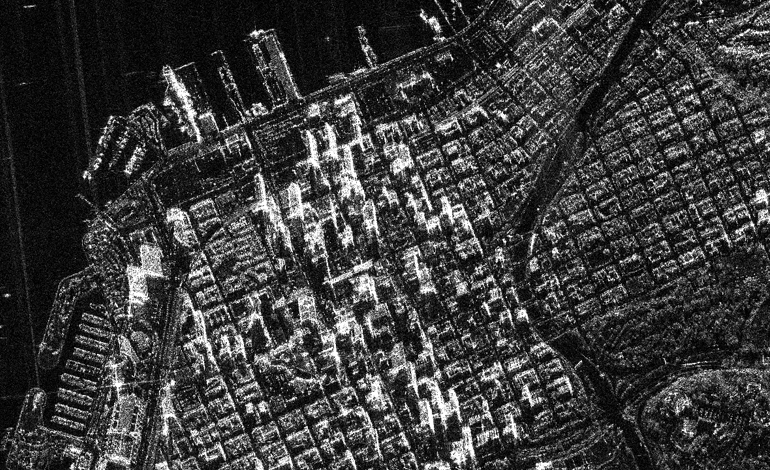
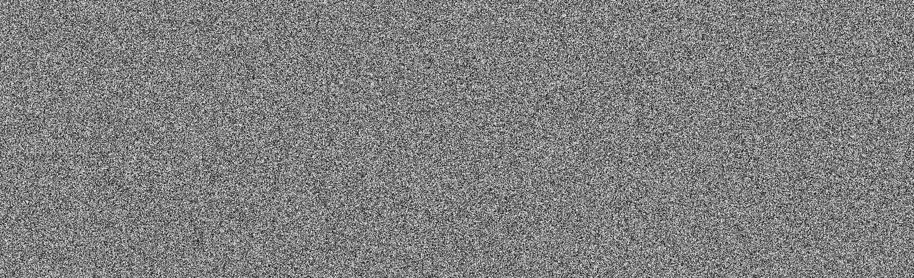
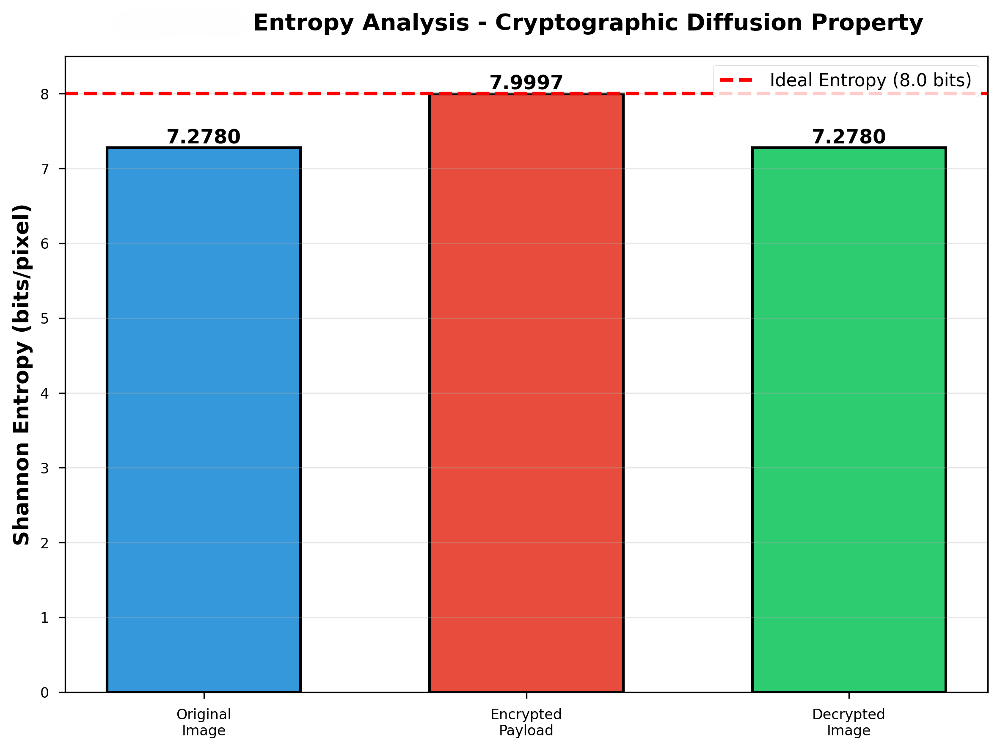
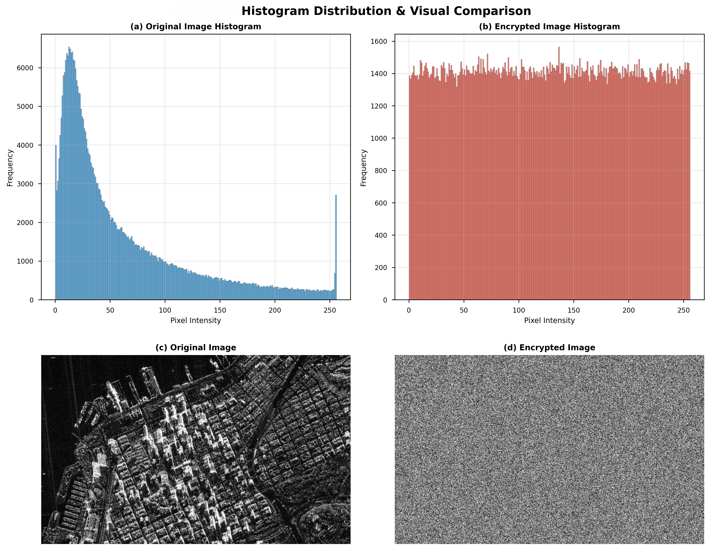
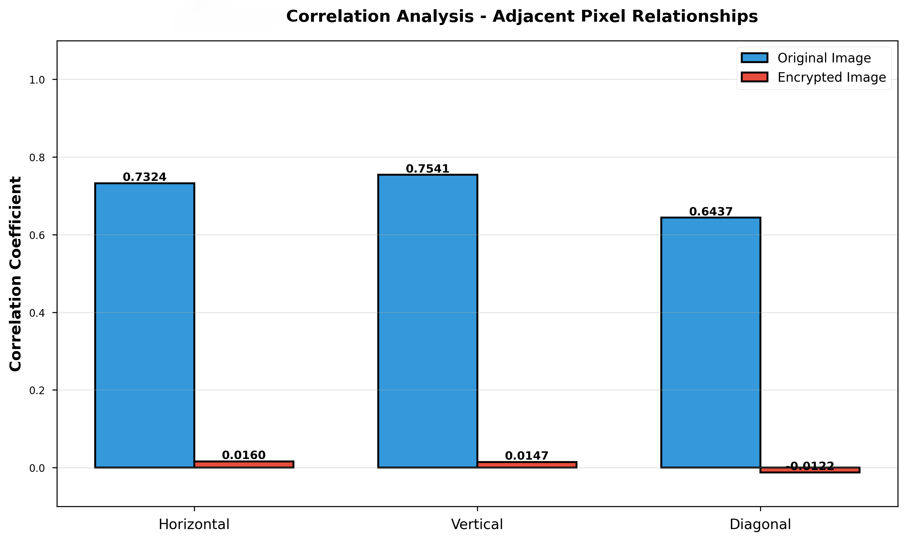
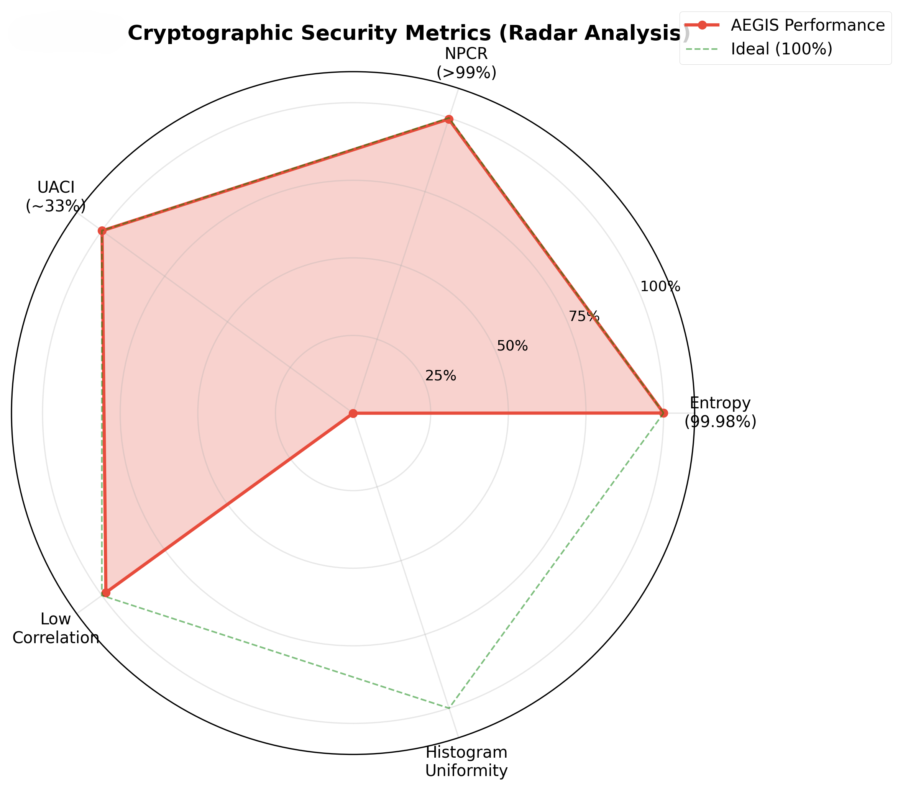
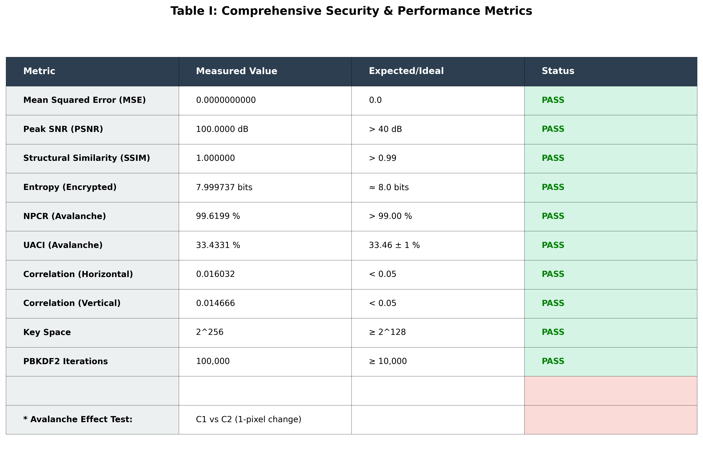
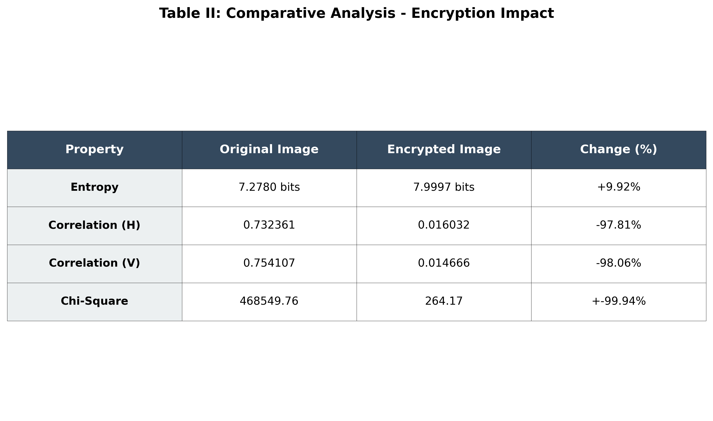

# Project AEGIS — Context-Aware Tactical Image Encryption

> Achieving 0.0 MSE via Integer Wavelets and Biological DNA Algebra

A research prototype for lossless, context-aware image encryption designed for power-constrained tactical edge devices (UAVs, satellites). Tested on high-resolution Synthetic Aperture Radar (SAR) imagery.

---

## Overview

Standard block ciphers (e.g., AES) apply identical operations across every pixel, wasting compute on empty background regions. Standard wavelet transforms introduce floating-point rounding errors, making true lossless reconstruction impossible.

**Project AEGIS** addresses both problems:

- Uses an **Integer Haar Wavelet Transform (Lifting Scheme)** — no floating-point arithmetic, guaranteeing 0.0 MSE reconstruction.
- Implements a **Master-Slave thresholding protocol** — applies heavy DNA-Addition to structural targets, lightweight DNA-XOR to background regions.
- Generates **channel-isolated key streams** via a Lorenz chaotic system seeded with PBKDF2-HMAC-SHA256 (100,000 iterations), preventing cross-channel structural bleed.

---

## System Architecture

---

## Results

### Visual Comparison

| Original Image | Encrypted Output | Decrypted Image |
|:-:|:-:|:-:|
|  |  |  |

---

### Entropy Analysis

Encrypted entropy reaches 7.9997 bits/pixel — near the theoretical maximum of 8.0 bits.

---

### Histogram Uniformity

The encrypted image produces a flat, uniform histogram (Chi-Square: 264.17), eliminating statistical frequency attacks.

---

### Correlation Analysis

Adjacent pixel correlation is reduced from ~0.73 to ~0.016, dismantling the spatial structure of the original image.

---

### Security Metrics (Radar)

---

## Security & Performance Metrics

### Table I — Comprehensive Metrics

| Metric | Measured Value | Expected/Ideal | Status |
|---|---|---|---|
| MSE | 0.0000000000 | 0.0 | ✅ PASS |
| PSNR | 100.0000 dB | > 40 dB | ✅ PASS |
| SSIM | 1.000000 | > 0.99 | ✅ PASS |
| Entropy (Encrypted) | 7.999737 bits | ≈ 8.0 bits | ✅ PASS |
| NPCR (Avalanche) | 99.6199% | > 99.00% | ✅ PASS |
| UACI (Avalanche) | 33.4331% | 33.46 ± 1% | ✅ PASS |
| Correlation (H) | 0.016032 | < 0.05 | ✅ PASS |
| Correlation (V) | 0.014666 | < 0.05 | ✅ PASS |
| Key Space | 2^256 | ≥ 2^128 | ✅ PASS |
| PBKDF2 Iterations | 100,000 | ≥ 10,000 | ✅ PASS |

*Avalanche test: C1 vs C2 (1-pixel change in plaintext)*

---

### Table II — Encryption Impact

| Property | Original | Encrypted | Change |
|---|---|---|---|
| Entropy | 7.2780 bits | 7.9997 bits | +9.92% |
| Correlation (H) | 0.732361 | 0.016032 | −97.81% |
| Correlation (V) | 0.754107 | 0.014666 | −98.06% |
| Chi-Square | 468,549.76 | 264.17 | −99.94% |

---

## Cryptographic Parameters

| Parameter | Value |
|---|---|
| Key Space | 2^256 |
| Key Derivation | PBKDF2-HMAC-SHA256 |
| PBKDF2 Iterations | 100,000 |
| Chaotic System | 3D Lorenz |
| Wavelet Type | Integer Haar (Lifting Scheme) |
| DNA Rules | 8 (Addition + XOR) |
| Execution Time (Python) | ~23 seconds (unoptimized) |

---

## Key Advantages Over AES-256

| Feature | Standard AES-256 | Project AEGIS |
|---|---|---|
| Spatial Awareness | None — uniform block operations | Context-aware Master-Slave thresholding |
| Background Regions | Encrypted at full cost | Lightweight DNA-XOR |
| Cross-Channel Bleed | Vulnerable (static salt) | Immune — channel-specific salts |
| Reconstruction (MSE) | Format-dependent | 0.0 — mathematically guaranteed |
| Avalanche Trigger | Block chaining (CBC/GCM) | SHA-256 plaintext hash bound to salt |

---

## Limitations

- Current implementation is a **Python research prototype** — not optimized for production.
- Execution time (~23 seconds) is practical for asynchronous transmission but not real-time.
- Tested on grayscale SAR imagery; full RGB pipeline is implemented but not independently benchmarked.

---

## Planned Enhancements

- **Hardware compilation** — Rewrite core operations in Rust/C++ with AVX support (target: sub-second execution).
- **Post-Quantum Cryptography** — Replace PBKDF2 with CRYSTALS-Kyber (NIST-approved lattice-based KEM).
- **Temporal video extension** — Expand to 3D Integer Wavelet Transforms for real-time UAV video streams.

---

## Paper

The full research paper is available here: [docs/Context-Aware Tactical Image Encryption Achieving 0.0 MSE via Integer Wavelets and Biological DNA Algebra.pdf](docs/Context-Aware Tactical Image Encryption Achieving 0.0 MSE via Integer Wavelets and Biological DNA Algebra.pdf)

---

## License

This project is licensed under the MIT License — see the [LICENSE](LICENSE) file for details.

---

## Authors

- **Byna Sriroop** — sriroop123@gmail.com
